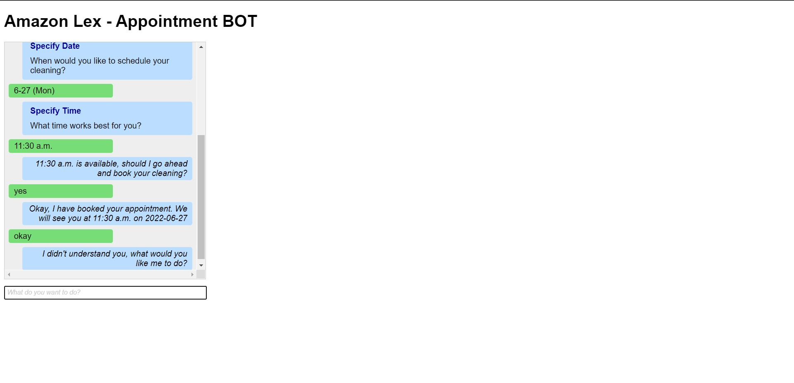
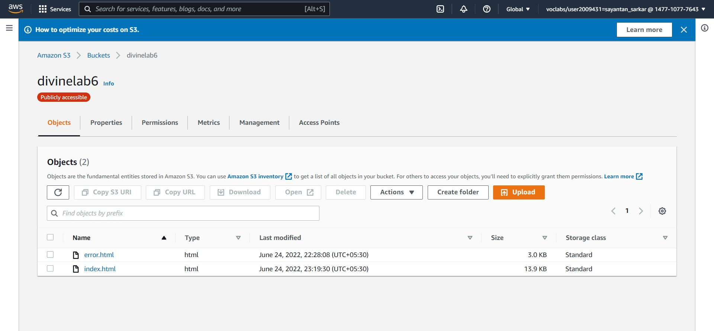
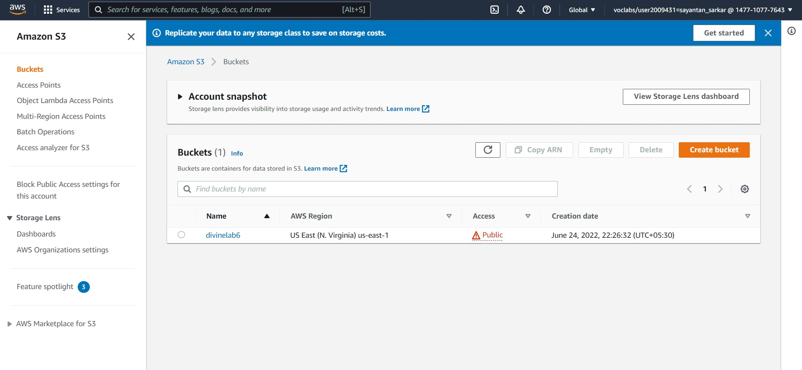

# Amazon Lex Appoinment Bot

## Additional Information

- Creation and Testing of a bot through ***Amazon Lex***

- ***AWS Lambda function*** to perform *initiation*, *validation*, and *fulfillment* tasks

- Deploying the bot in the static webpage hosted on ***Amazon Simple Storage Service (Amazon S3)***

## Screen Shots

- Front End

- Others

# Getting Started with Amazon Lex

## Task 1: Creating a bot with Amazon Lex
In this task, you will create a bot by using the AWS Management Console.
To create a bot with Amazon Lex:
	1. On the AWS Management Console, on the Services menu, choose Amazon Lex.
	2. On the Amazon Lex page, choose Get Started.
	3. In the left navigation pane, choose Return to the V1 console.
	4. Choose Create.
	5. On the Create your bot page, choose the ScheduleAppointment blueprint.
	6. For the Language section, select English (US).
	7. For the COPPA section, select No.
	8. Choose Create.

## Task 2: Testing your bot
Now, you will test your bot by using the test window in the console.
	9. When you see the status Ready Build complete, test your bot by entering the following values:
	1. I would like to make an appointment
	2. A root canal
	3. 15/5/2022
	4. 23:00 PM
    5. Yes

## Task 3: Creating an AWS Lambda function
## Task 4: Testing your Lambda function
## Task 5: Updating the intent of your bot
## Task 6: Building and testing your bot

